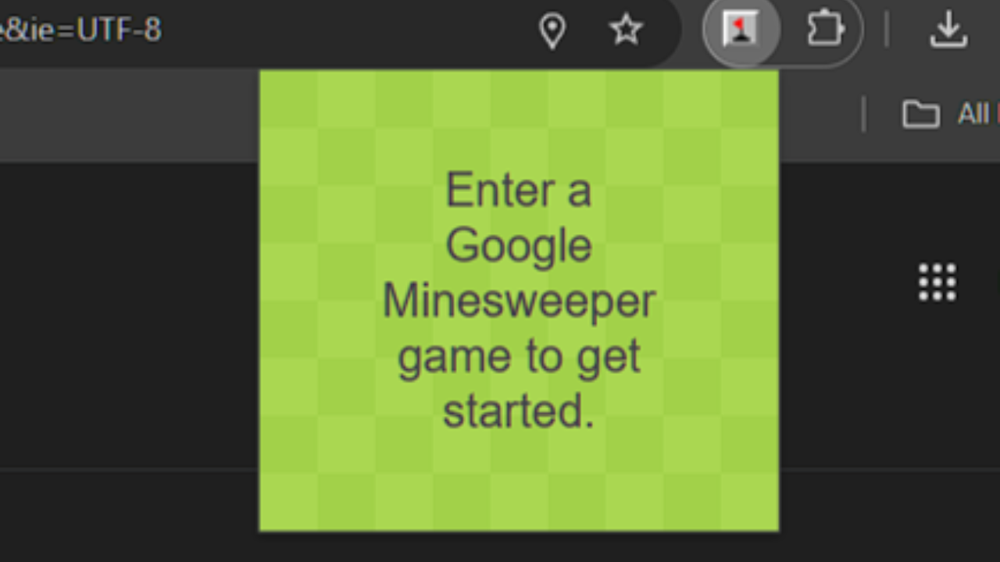

# Minesolver

This Chrome extension automatically detects and solves **Google's Minesweeper** using computer vision powered by Vision Transformer (ViT)

See a demo below!

<a href="https://www.youtube.com/watch?v=VugUWUprkCs">See a demo!</a>

## Features

- Detects covered, flagged, and revealed tiles
- Solves Minesweeper with logic-based strategies
- Simulates mouse clicks to interact with the game
- Simple UI to start solving from the Chrome toolbar

## How It Works

1. Navigate to [Google's Minesweeper](https://www.google.com/fbx?fbx=minesweeper)
2. Click the extension icon and press **Start Solving**
3. The extension:
   - Captures the canvas
   - Uses OpenCV.js to detect game tiles
   - Applies a logic solver
   - Dispatches click events on safe tiles

## Tech Stack

- JavaScript (Chrome Extensions API)
- OpenCV.js for image processing
- HTML/CSS for popup UI
